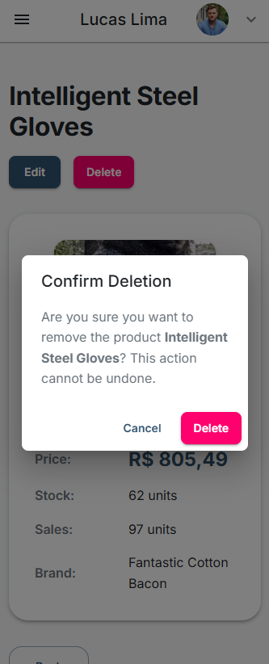
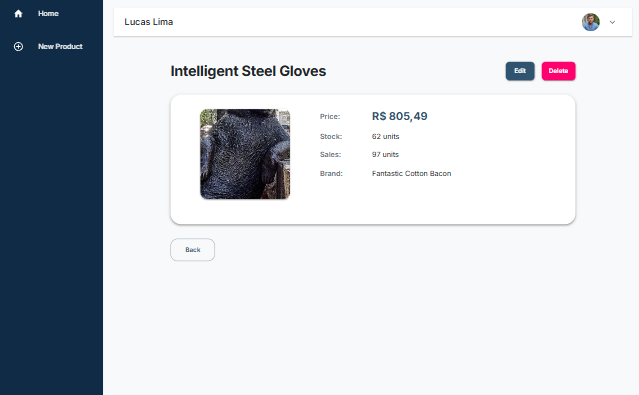

<p align="center">
  
</p>

<h1 align="center">Stockly</h1>

## 📖 About

<p align="left">
  Stockly is an application with features for registration, login, and product management using React, TypeScript, and other technologies such as React Router, Material-UI, and form validations. The project includes protected routes, product listing and creation, as well as features like authentication and navigation. The focus is to demonstrate the ability to apply best practices in frontend development and integration with simulated APIs.
</p>

---

## 🚀 Technologies Used

- **Frontend**: React.js with TypeScript
- **Component Library**: Material-UI (MUI)
- **State Management**: Context API
- **Form Validation**: React Hook Form
- **Routing**: React Router
- **Notifications**: React Toastify
- **Styling**: Material-UI `sx` and theme system
- **External API**: ViaCEP (for address lookup by ZIP code)

## 📂 Project Structure

```plaintext
src/
├── assets/           # Images
├── components/       # Reusable UI components
├── contexts/         # Context API for state management
├── hooks/            # Custom hooks
├── pages/            # Page components
├── routes/           # Application routes
└── styles/           # Global styles and themes
```

---

## 📸 Screenshots

| Login Mobile | Home Mobile | Delete Mobile | Edit Mobile |
|-----------|-----------|-------------|-------------|
|  |  |  |  |

| Home Desk | Details Desk |
|-----------|-------------|
|  |  |

---

## 🛠️ Features

### User Registration
- Validation of required fields (name, CPF, email, etc.).
- CPF validation using the `cpf-check` library.
- Automatic address lookup with the ViaCEP API when the ZIP code is provided.

### Authentication
- Generation of unique tokens for each registered user.

### User Feedback
- Success or error notifications with React Toastify.

### Responsive Design
- Material-UI breakpoint system to adapt the interface to different screen sizes.

---

## 🎯 Installation & Setup

1. Clone the repository or open the folder on your machine:
   ```sh
   git clone https://github.com/leclm/stockly.git
   cd stockly
   ```

2. Install dependencies:
   ```sh
   npm install
   ```

3. Start the development server:
   ```sh
   npm run dev
   ```

4. Open [http://localhost:5173](http://localhost:5173) in your browser.

---

## 🌐 API Endpoints

The application uses a mock API to manage user data. Below are the available endpoints:

### POST /user
- **Description**: Registers a new user.
- **URL**: [https://67ddc6fd471aaaa7428282c2.mockapi.io/api/v1/user](https://67ddc6fd471aaaa7428282c2.mockapi.io/api/v1/user)
- **Request Body**:
  ```json
  {
    "nome": "string",
    "sobrenome": "string",
    "cpf": "string",
    "sexo": "string",
    "dt_nascimento": "timestamp",
    "cep": "string",
    "cidade": "string",
    "estado": "string",
    "logradouro": "string",
    "bairro": "string",
    "complemento": "string",
    "email": "string",
    "senha": "string",
    "token": "string"
  }
  ```
- **Response**:
  - `200 OK`: Successful registration.
  - `400 Bad Request`: Error in the sent data.


### **POST /product**

- **Description**: Registers a new product in the system.
- **URL**: [https://67ddc6fd471aaaa7428282c2.mockapi.io/api/v1/product](https://67ddc6fd471aaaa7428282c2.mockapi.io/api/v1/product)  
- **Request Body**:
  ```json
  {
    "nome": "string",
    "image": "string",
    "preco": "number",
    "qt_estoque": "number",
    "qt_vendas": "number",
    "marca": "string"
  }
  ```
  
- **Response**:
  - `200 OK`: Successful registration.
  - `400 Bad Request`: Error in the sent data.
  
- **Example Response**:
  ```json
  {
    "id": "18",
    "nome": "Intelligent Steel Gloves",
    "image": "https://loremflickr.com/445/2270?lock=6621251456457852",
    "preco": "805.49",
    "qt_estoque": 62,
    "qt_vendas": 97,
    "marca": "Fantastic Cotton Bacon",
    "createdAt": "2025-03-26T16:13:55.556Z"
  }
  ```